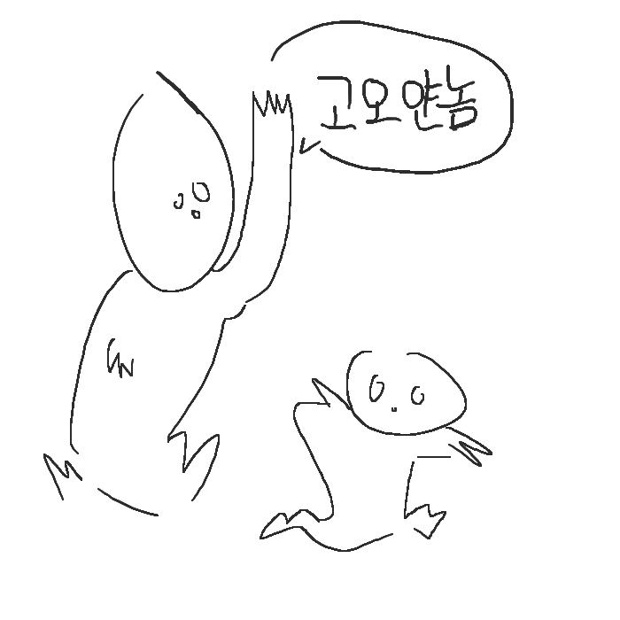
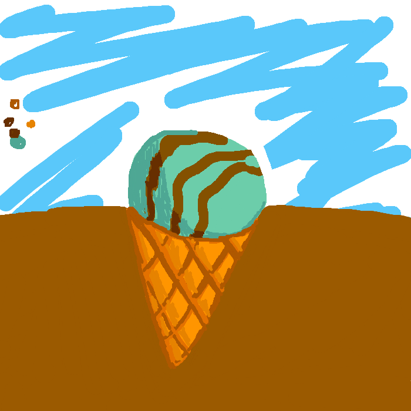

# gsgs95.github.io
gsgs95.com

## 웹프로그래밍-기초 수업레포
---
**[Project Link](https://gsgs95.github.io "Project:Intro")**

**[연습문제 목록](https://gsgs95.github.io/practice "연습문제 목록")**

## 페인터 프로젝트 링크
**[Painter Link](https://gsgs95.github.io/painter.html "Project:Painter")**

## Painter Usage
배경은 기본적으로 투명입니다.
지우개 사용시 clearRect로 똑같이 투명이 됨.

### Keyboard Hotkey
|Keyboard|Description|
|:-:|:-:|
|P|Pen|
|E|Eraser|
|G|Bucket|
|O|Pipette|
|[|decrease pen-linewidth|
|]|increase pen-linewidth|
---

## Painter 사용예시
친구들에게 테스트를 요청해보았습니다

