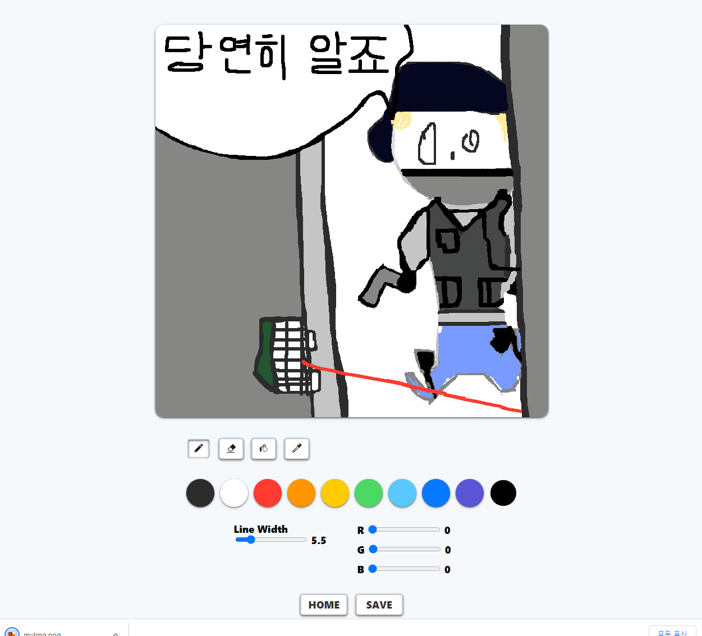

# gsgs95.github.io  
gsgs95.com  

## 웹프로그래밍-기초 수업레포  
---
**[Project Link](https://gsgs95.github.io "Project:Intro")**  

**[연습문제 목록](https://gsgs95.github.io/practice "연습문제 목록")**  

## 페인터 프로젝트 링크
**[Painter Link](https://gsgs95.github.io/painter.html "Project:Painter")**  
  
## Painter Usage
배경은 기본적으로 투명입니다.  
지우개 사용시 clearRect로 똑같이 투명이 됨.  
HOME : 메인페이지로 넘어갑니다.  
SAVE : 로컬폴더에 현재 canvas에 있는 그림을 "myImg.png"포멧으로 저장합니다.  

고정색 버튼 : 각 고정색상을 담고있는 9가지 기본색 버튼.  
자유색 버튼 :RGB값을 변경할 수 있는 1개의 자유색 버튼을 가집니다.  
**스포이드 모드에서 캔버스를 클릭하면 자유색버튼에 색이 담아집니다.**  
LineWidth : 0.1~30.0 까지 0.1단위로 조절가능합니다.  

### Keyboard Hotkey
|Keyboard|Description|
|:-:|:-:|
|P|Pen|
|E|Eraser|
|G|Bucket|
|O|Pipette|
|[|decrease pen-linewidth|
|]|increase pen-linewidth|
---

## Painter 사용예시
친구들에게 테스트를 요청해보았습니다  
  
  
  
  